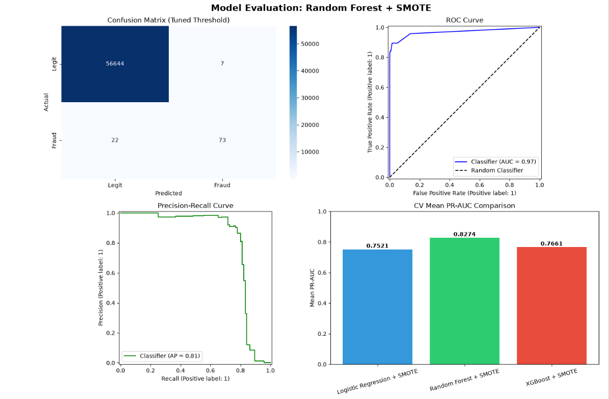

# 💳 Credit Card Fraud Detection Using Machine Learning


> A machine learning project for detecting fraudulent credit card transactions using supervised learning techniques. This project addresses the severe class imbalance using **SMOTE**, evaluates multiple classification models, and selects the best-performing model based on **Precision-Recall AUC (PR-AUC)**.

---

## 📊 Project Overview


This project develops an end-to-end fraud detection pipeline using Python and Scikit-learn. It follows the complete machine learning workflow, from exploratory data analysis and preprocessing to model training, evaluation, and comparison.

Since fraudulent transactions represent only **0.17%** of the dataset, traditional accuracy is not a reliable performance metric. Therefore, this project focuses on **Precision-Recall AUC (PR-AUC)** and **ROC-AUC** to evaluate model performance.

---

# 📌 Project Workflow

```
Data Exploration
        │
        ▼
Data Cleaning
        │
        ▼
Exploratory Data Analysis (EDA)
        │
        ▼
Data Preprocessing
        │
        ▼
Machine Learning Pipelines
        │
        ▼
Cross Validation
        │
        ▼
Model Selection
        │
        ▼
Test Set Evaluation
        │
        ▼
Conclusion
```

---

# 📂 Dataset

The project uses the **Credit Card Fraud Detection Dataset**, containing real-world credit card transactions made by European cardholders.

| Property | Value |
|----------|-------|
| Total Transactions | **284,807** |
| Features | **30** |
| Target | **Class** |
| Legitimate Transactions | **284,315** |
| Fraudulent Transactions | **492 (0.17%)** |

### Features

- **Time** – Seconds elapsed between transactions
- **V1 – V28** – PCA-transformed anonymous features
- **Amount** – Transaction amount
- **Class** – Target variable (0 = Legitimate, 1 = Fraud)

---

# 🛠 Technologies Used

- Python
- NumPy
- Pandas
- Matplotlib
- Seaborn
- Scikit-learn
- Imbalanced-learn (SMOTE)
- XGBoost
- Jupyter Notebook

---

# 🔍 Exploratory Data Analysis (EDA)

The exploratory analysis includes:

- Dataset overview
- Statistical summary
- Missing value inspection
- Duplicate record removal
- Class imbalance analysis
- Transaction amount distribution
- Transaction time distribution
- Correlation heatmap
- Boxplots
- Countplots

---

# ⚙️ Data Preprocessing

The following preprocessing steps were applied before model training:

- Feature/target separation
- Stratified train-test split (80/20)
- Standardization using **StandardScaler**
- Class imbalance handling using **SMOTE**
- Pipeline implementation to prevent data leakage

---

# 🤖 Machine Learning Models

Three supervised learning algorithms were evaluated:

- Logistic Regression
- Random Forest
- XGBoost

Each model was implemented using an **Imbalanced-learn Pipeline**, consisting of:

```
StandardScaler
        │
        ▼
SMOTE
        │
        ▼
Classifier
```

---

# 📈 Model Evaluation

Models were compared using **3-Fold Stratified Cross-Validation**.

### Evaluation Metrics

- Precision
- Recall
- F1-Score
- ROC-AUC
- Precision-Recall AUC (Average Precision)

> Since this dataset is highly imbalanced, **PR-AUC** was selected as the primary metric for model comparison.

---

# 🏆 Cross-Validation Results

| Model | Mean PR-AUC |
|--------|------------:|
| Logistic Regression + SMOTE | **0.7521** |
| Random Forest + SMOTE | **0.8274** |
| XGBoost + SMOTE | **0.7661** |

## ✅ Best Model

**Random Forest + SMOTE**

---

# 📊 Test Set Performance

| Metric | Score |
|---------|-------|
| ROC-AUC | **0.9694** |
| PR-AUC | **0.8115** |

### Classification Report

| Class | Precision | Recall | F1-score |
|-------|----------:|-------:|----------:|
| Legitimate | 1.00 | 1.00 | 1.00 |
| Fraud | **0.91** | **0.77** | **0.83** |

---

# 📷 Results

## Model Evaluation



The final evaluation includes:

- Confusion Matrix
- ROC Curve
- Precision-Recall Curve
- Cross-Validation Comparison

---

# 💡 Key Findings

- The dataset is extremely imbalanced, with fraudulent transactions representing only **0.17%** of all observations.
- SMOTE effectively balanced the training data while preventing data leakage through pipelines.
- Random Forest achieved the highest PR-AUC among the evaluated models.
- ROC-AUC of **0.9694** indicates excellent discrimination between legitimate and fraudulent transactions.
- PR-AUC of **0.8115** demonstrates strong fraud detection performance on unseen data.
- PR-AUC proved to be a more informative metric than overall accuracy for this classification problem.

---

# 📁 Repository Structure

```
Credit-Card-Fraud-Detection/
│
├── images/
│   └── model_evaluation.png
│
├── Credit_Card_Fraud_Detection.ipynb
├── creditcard.csv
├── requirements.txt
├── README.md
└── LICENSE
```

---

# 🚀 Installation

Clone the repository

```bash
git clone https://github.com/ArianJr/credit-card-fraud-detection.git
```

Navigate to the project

```bash
cd credit-card-fraud-detection
```

Install dependencies

```bash
pip install -r requirements.txt
```

Launch Jupyter Notebook

```bash
jupyter notebook
```

Open

```
credit_card_fraud_detection.ipynb
```

---

# 🔮 Future Improvements

Possible extensions include:

- Hyperparameter tuning using GridSearchCV or Optuna
- Feature importance analysis
- SHAP explainability
- Threshold optimization
- Cost-sensitive learning
- Deep learning models for fraud detection
- Real-time fraud detection deployment

---

# 🎯 Conclusion

This project demonstrates a complete machine learning workflow for detecting fraudulent credit card transactions. Through exploratory data analysis, careful preprocessing, and robust model evaluation, multiple classifiers were compared using Stratified Cross-Validation and Precision-Recall AUC.

Among the evaluated models, **Random Forest combined with SMOTE** achieved the strongest overall performance, obtaining a **Cross-Validation PR-AUC of 0.8274**, a **Test ROC-AUC of 0.9694**, and a **Test PR-AUC of 0.8115**. These results indicate that the model effectively distinguishes fraudulent transactions while maintaining strong precision and recall despite the severe class imbalance.

Overall, this project highlights the importance of proper preprocessing, data leakage prevention through machine learning pipelines, and selecting evaluation metrics that are appropriate for imbalanced classification problems.

---

# 👨‍💻 Author

**Arian**
Machine Learning • Data Science • Python

---

# ⭐ If you found this project useful, consider giving it a star!
---

# ⭐ If you found this project useful, consider giving it a star!
